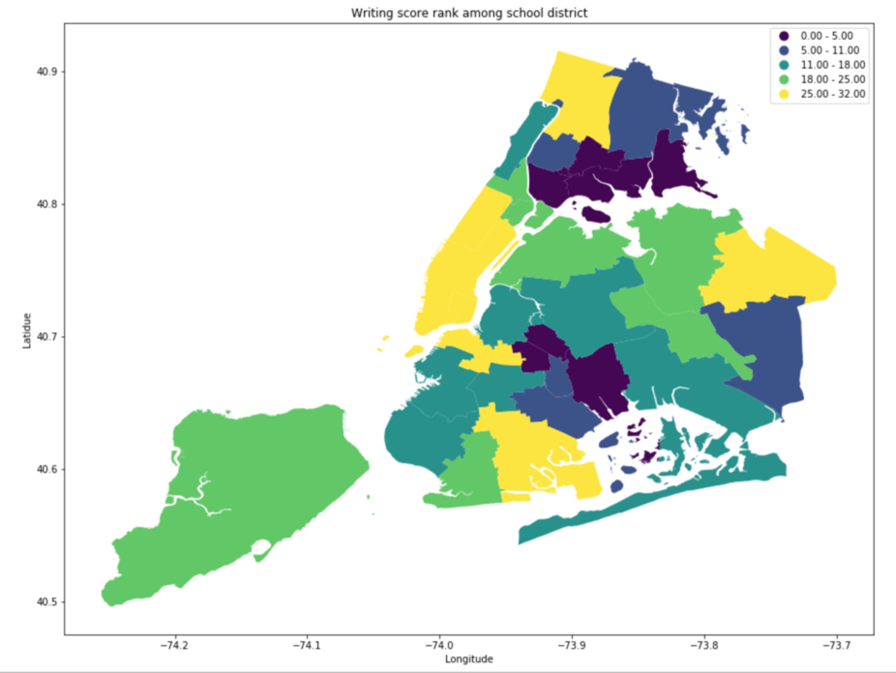

## Assignmnet 1
For Assignment visulization, I visulize the school district performance on SAT exam, creating a map showing the rank of school district in New York on SAT exam. Totally, there are 4 maps : critical reading score rank, math score rank, writing score rank, and total score rank.

I use three dataset : 
school district : https://data.cityofnewyork.us/Education/School-Districts/r8nu-ymqj

it offer a shapefile containing the boundary of school districts

High school directory: https://data.cityofnewyork.us/Education/2017-DOE-High-School-Directory/s3k6-pzi2

it contains the high shcool name of NYC and the latitude and longitude data for each school, I utilized this dataset as an intermediary for merging

school SAT score:  https://data.cityofnewyork.us/Education/2012-SAT-Results/f9bf-2cp4

It contains the mean SAT score (Critical reading, writing, math) and number of students taking the exam for each school

or they can be download from this repository https://github.com/haomingsama/PUI2018_hy1528/tree/master/HW8_hy1528

Visulization
---
I first plot the  mean critical reading score for each school on the school district map to see the distritbution

### Figure1:

 The figures shows all the high school mean critical reading score on the school district map. The lighter the color indicate the higher the score. From the map, although it is very difficult, we could identify which school district have higher score in the SAT exam. For example, the school district in Manhattan have the highest mean critical reading score.
 
 ---
 Then, I calculate the mean score(critical reading, math, writing) for each school district by taking the weight average of the school score in that district.
 

### Figure2:

The figures shows the rank of mean critical reading score on school district level. The lighter the color indicate the higher the score. From the map,  we could easily identify which school district have higher score in the SAT exam on critical reading part. 

### Figure3:

The figures shows the rank of mean math score on school district level. The lighter the color indicate the higher the score. From the map,  we could easily identify which school district have higher score in the SAT exam on math part. We could find that some district remain high score in both critical reading and math.

### Figure4:

The figures shows the rank of mean writing score on school district level. The lighter the color indicate the higher the score. From the map,  we could easily identify which school district have higher score in the SAT exam on writing part. We could find that some district remain high score in critical reading,math,writing.

### Figure5:

The figures shows the rank of mean total score on school district level. The lighter the color indicate the higher the score. From the map,  we could easily identify which school district have higher score in the SAT exam. We could identify the district that produce highest score in SAT exam.

---
## Assignment 2:

Link of Authorea report : https://www.authorea.com/336151/nuil-MCRM33sMgTPUx8HSg
