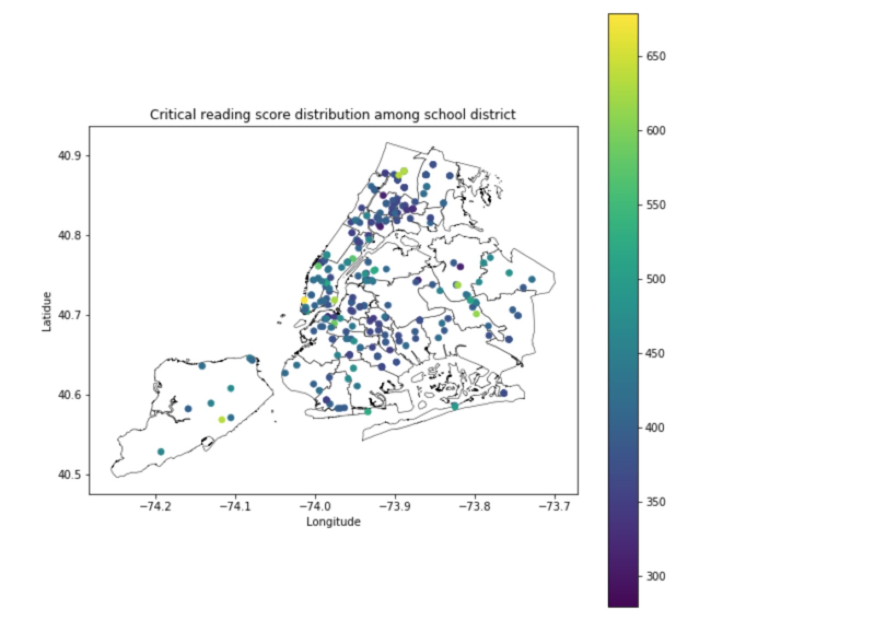
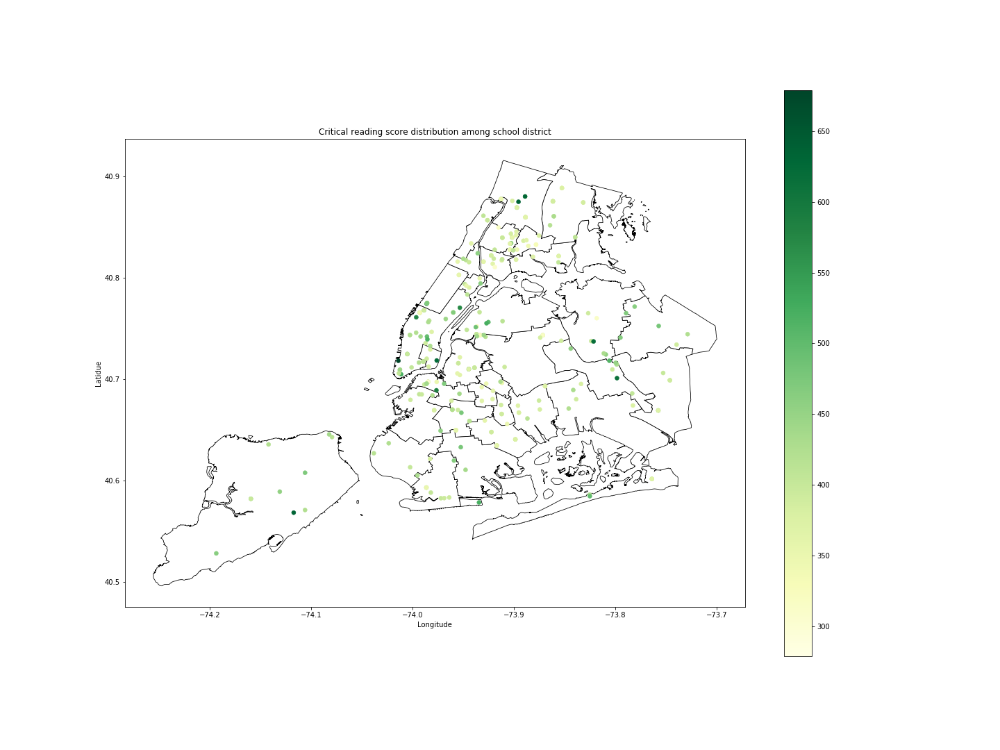

## Assignment 1

## Assignment 2
**The review I received from jl9489 :**

"I just have one question: for Figure 1, I'm assuming that each dot represents a different school district. However, for the other figures (Figure 2-5), **the school districts are not as clear.**

**"Is it that the dots in Figure 1 are the school districts, or do regions highlighted in the other figures represent the school districts?"**

**Answer:** Thanks for pointing this out. It is somewhat misleading. In figure1, Each dot represents the each school. I will make it more clear in the caption. The school district is the map itself. The region highlighted is the result of calculation of the mean score of the shcool in that region. 

---
**The review I received from hl3282 :**

The topic is interesting. The clear title, legend, x-axis label and y-axis label are included in all of plots. And the caption is clear. **However, in the first plot, the color distribution is too focused on deep color so I suggest to relocate the classification of data to distinguish from colors and increase the figure size to maximize the clearity. And maybe it is better to draw the deep boundaty line to distinguish between school districts.**

**Answer:** Great feedback! I change the layout of the first plot according to your suggestion. The original color is too dark and it is hard to recognize the high value. I change to another light color and increase the figure size for the clearity. I increase the deepth of boundary line a little bit to distinguish between school districts. Thank you for your suggestion.

### Before 

### Figure1:
The figures shows all the high school mean critical reading score on the school district map. The lighter the color indicate the higher the score. From the map, although it is very difficult, we could identify which school district have higher score in the SAT exam. For example, the school district in Manhattan have the highest mean critical reading score.

### After modication

### Figure1:
The figures shows all the high school mean critical reading score on the school district map. The darker the color indicate the higher the score. From the map, we could identify which school district have higher score in the SAT exam. For example, the school district in Manhattan have the highest mean critical reading score.
