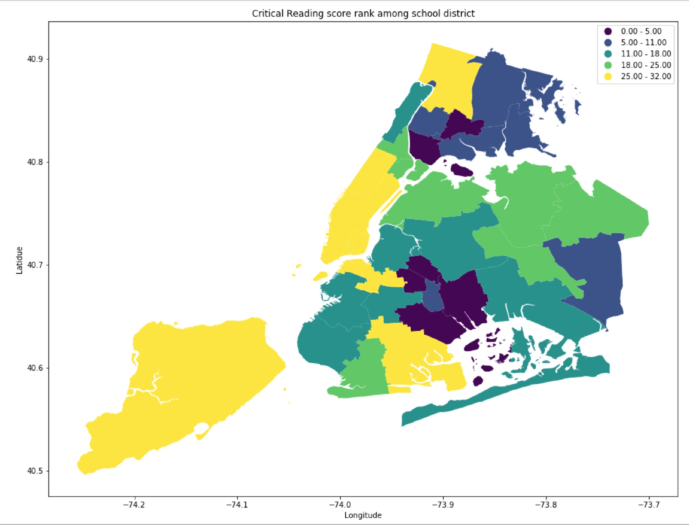
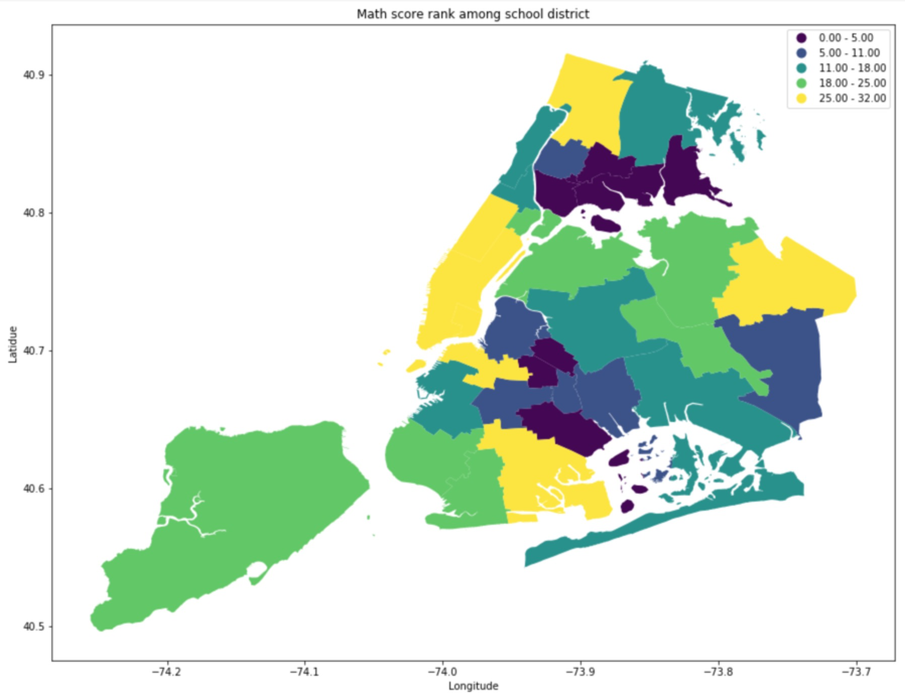
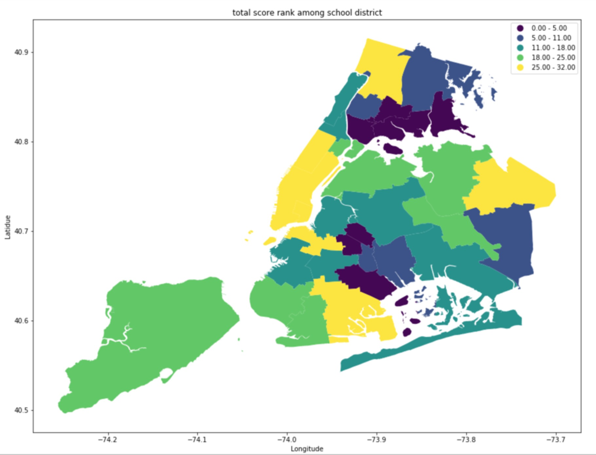

## Assignmnet 1
For Assignment visulization, I visulize the school district performance on SAT exam, creating a map showing the rank of school district in New York on SAT exam. Totally, there are 4 maps : critical reading score rank, math score rank, writing score rank, and total score rank.

I use three dataset : 
school district : https://data.cityofnewyork.us/Education/School-Districts/r8nu-ymqj

High school directory: https://data.cityofnewyork.us/Education/2017-DOE-High-School-Directory/s3k6-pzi2

school SAT score:  https://data.cityofnewyork.us/Education/2012-SAT-Results/f9bf-2cp4

or they can be download from this repository

## Assignment 2:

Link of Authorea report : https://www.authorea.com/336151/nuil-MCRM33sMgTPUx8HSg
