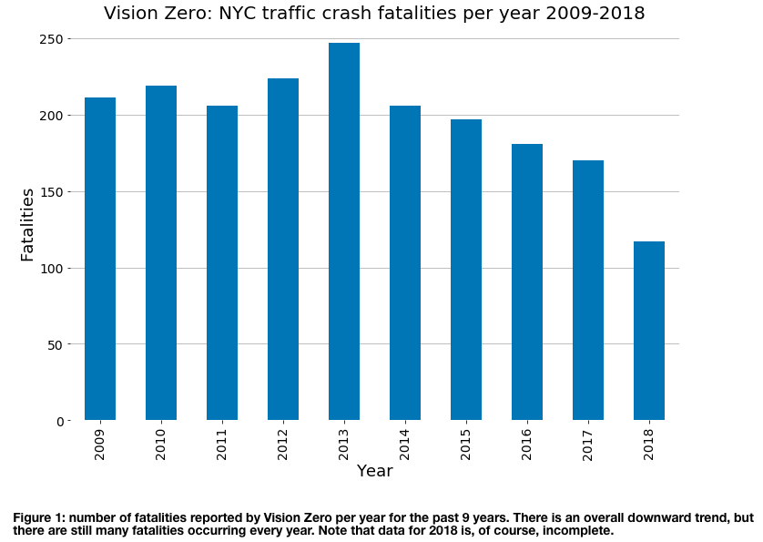

## Review of visulization:

Aric Werner:With urban-related data of my choice, [create a plot](https://github.com/aawerner/PUI2018_aaw329/blob/master/HW8_aaw329/HW8_1_aaw329.ipynb) a la the visualization lecture. For this, I chose to use Vision Zero traffic crash data.

Review by Haoming Yang (hy1528):

Here is my review about the visulization

**CLARITY**: 
The plot is a bar chart showing the fatalities in traffic crash from 2009 to 2018(incomplete).
It is simple and easy to read. The title,labels and caption are clearly stated. It also inlcues the measure of unit in the caption in case that people get confused about the number on the vertical axis. This plot is very clear.

**ESTHETIC**:
The graph is succinct. It does not contain any useless information and the choice of color is suitable for all people. Since the caption mention about the trend of fatalities, line chart would be more suitable for showing the trend compared with bars. That will make the plot more succinct, creating more white space and reduce distraction.

**HONESTY**:
The data are well represented by the bar chart.
The graph may have a weakness that it shows incomplete data on the bar 2018. This could be misleading if people don't look at the caption. It would be better to change the name of the incomplete bar by showing how many months are included in this bar. 

Summary for the improvement:

1. Consider line chart in showing the trend. it will be more succinct.

2. Consider changing the 2018 bar into more specific one(showing number of months included in the data)

Thank you.
